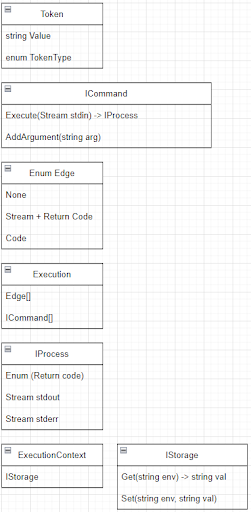
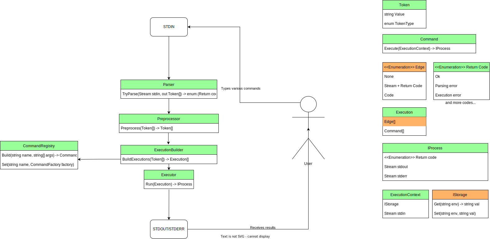

# Основные абстракции и модели

## Пояснения:
**Token** - модель для разбора текста. Помимо значения, содержит информацию о типе токена. Например, в качестве токенов есть такие:
* Текстовый токен (Любой текст без пробелов и спецсимволов)
* Токен одинарных кавычек (всё что в парных одинарных кавычках объединяется в один токен)
* Операторы (`| & ; > …`)
* Токен двойной кавычки (этот отдельный символ идёт отдельным токеном)
* Токен `=`
* Токен подстановки (`$X`)

**Command** - абстрактный класс для описания команды. Принимает в конструкторе набор аргументов как `string[]`. Содержит логику самой команды (Execute), и умеет читать поток ввода.

**Stream** - абстракция “потока данных”. В самом простом варианте просто буфферизует данные внутри себя. Можно как читать, так и писать. 

**Edge** - enum для описания “ребра связи” между командами. Если представить однопоточный граф исполнения команд, то порядок и отношения между командами связаны рёбрами. Вот это оно и есть :) Например, среди значений есть такие:
* None (пользователь указал несколько команд через точку с запятой – команды никак не связаны, результаты предыдущей команды можно игнорировать, или перенаправить в stdout/stderr)
* Команды связаны пайпой, необходимо передать return code и поток вывода на поток входа следующей команды. Если return code ненулевой - исполнение не требуется.
* Команды связаны `&&`, если предыдущая завершилась печально - исполнение не требуется. В связи с этим нам интересен лишь Return code
* (Опционально) После команды стоит `>`, следует куда-то передать поток вывода

**Execution** - набор команд последовательного исполнения (Граф всегда выглядит как цепочка). Содержит массив рёбер и команд.

**IProcess** - абстракция для (потенциально асинхронного) выполнения Execution. Помимо Return Code (который может отсутствовать если вычисление ещё в процессе), содержит также поток вывода и поток ошибок.

**IStorage** - абстракция для хранения значений переменных. Может быть как InMemory, так и File, так и по-настоящему хранить значения в переменных окружения ОС.

**ExecutionContext** - подаётся во время выполнения команде. Пока содержит лишь IStorage, но потенциально может содержать дополнительную информацию, необходимую для вычислений. Точка расширения.

## Основная схема и поток данных
Клиентская часть на текущий момент в абстракции не выделена, в простейшем виде выглядит как `while(true)` парсинг и вывод результатов команд. Возможно, стоит как-то адресовать это, но пока мотивация не ясна.

Поток данных через stdin целиком вычитывается и буферизуется, и направляется в Parser. 

**Parser** состоит из двух простых компонентов: **Linter** и **Lexer**.
**Linter** проверяет корректность ввода, проверка существования токена, проверка правильности последовательности кавычек.
При наличии ошибок, возвращает return code, способный указать тип ошибки, позицию ошибки в исходной строке. Parser способен его вернуть обратно клиентской части.

Если же данные корректны, то вход подаётся Lexer’у, который токенизирует по следующим правилам:
1. Пробельные символы выделяются в отдельные токены
2. Отдельно выделяются токены подстановки. 
3. Отдельно выделяется токен двойных кавычек
4. Отдельно выделяется токен присваивания. (Например, `X=$Y` - это отдельный токен)
5. Отдельно выделяются операторы (описаны выше)
6. Всё что находится в одинарных кавычках выделяется целиком, внутри нет разбиения на токены
7. Всё остальное выделяется в текстовый токен

Далее можно подавать данные препроцессору: абстракция произвольного преобразования/переупорядочивания/фильтрации токенов.
Например, среди препроцессоров нам нужны следующие:
1. Препроцессор подстановки (подставляет значения из переменных окружения в токены подстановки)
1. Препроцессор объединения двойных кавычек в текстовый токен (необходим именно такой порядок, чтобы соблюдался weak quoting). За счёт того, что одинарные кавычки не разбиваются на токены подстановки, full quoting также поддерживается.
1. Препроцессор обработки присваивания. Токен присваивания преобразуется в следующую последовательность токенов: `X=$Y` -> `= X $Y ;`
Это просто перевод в постфиксную нотацию. Нужно для обобщения кода (так как все команды исполняются в постфиксной нотации)
1. Фильтрация пробельных токенов.

При желании, мы можем проверить какое-нибудь условие, и повторить процесс парсинга и препроцессинга здесь, чтобы поддерживать метапрограммирование, но мы считаем, что это не очень хорошая практика,
и решаем не поддерживать это (на диаграмме обозначено `while false`). Тем не менее, внести соответствующее изменение относительно просто. (Фильтрацию пробельных токенов в таком случае будет необходимо 
производить на последней итерации подстановки)

После этого данные отправляются ExecutionBuilder’у, который из токенов собирает набор Execution’ов. (Набор, поскольку при желании мы можем поддержать возможность введения оператора параллельного выполнения).

В общем случае обработка выглядит следующим образом:
1. Берём команду, собираем аргументы до тех пор, пока не встретим какой-либо оператор. Идём и Build’им эту команду в CommandRegistry, сохраняем. Тип “ребра выполнения” определяется оператором. Подробнее про рёбра описано ранее.
Если оператор отсутствовал, в качестве ребра можно либо выбрать None, либо условиться, что рёбер всегда меньше на 1 чем команд. (Деталь реализации, не так важно).
1. В случае, если оператор является оператором параллельного выполнения, можем закончить текущий Execution, и начать строить следующий. 

Именно для такой обработки нам был нужен препроцессор постфиксной нотации. Теперь можем добавить команду `=`.

Последний шаг: выполнение (потенциально параллелльное) команд. В ответственности Executor’а входит создание ExecutionContext, и склейка последовательных выполнений через IProcess.
Результат после этого перенаправляется пользователю.
## Этапы разработки
Разработка делится на две фазы.
### Первая фаза. 
* планируется реализовать основные модели и функциональность;
* реализовать основные токены,  командами, основной препроцессинг, построитель и исполнитель;
* реализовать хранилище и реестр команд;
* добиться корректной работы основных сценариев работы с командной строкой.
### Вторая фаза. 
* планируется расширить модели и функциональность;
* расширить функциональность токенов и препроцессинга.
* реализовать ребра выполнения; реализовать линтер;
* добиться корректной работы командной строки с подстановками и пайпами.

Более детально представлено на диаграмме (первая фаза - зеленый цвет, вторая фаза - оранжевый).

